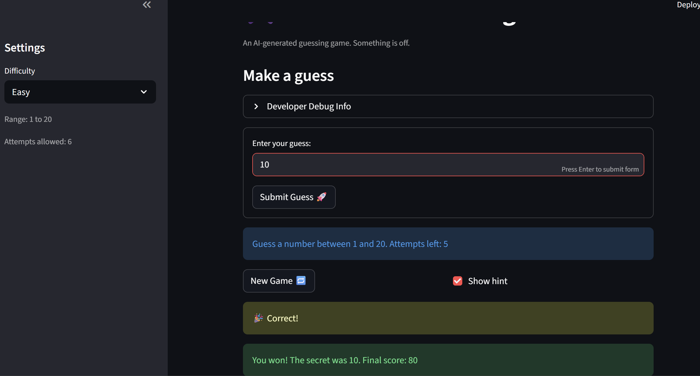

# 🎮 Game Glitch Investigator: The Impossible Guesser

## 🚨 The Situation

You asked an AI to build a simple "Number Guessing Game" using Streamlit.
It wrote the code, ran away, and now the game is unplayable. 

- You can't win.
- The hints lie to you.
- The secret number seems to have commitment issues.

## 🛠️ Setup

1. Install dependencies: `pip install -r requirements.txt`
2. Run the broken app: `python -m streamlit run app.py`

## 🕵️‍♂️ Your Mission

1. **Play the game.** Open the "Developer Debug Info" tab in the app to see the secret number. Try to win.
2. **Find the State Bug.** Why does the secret number change every time you click "Submit"? Ask ChatGPT: *"How do I keep a variable from resetting in Streamlit when I click a button?"*
3. **Fix the Logic.** The hints ("Higher/Lower") are wrong. Fix them.
4. **Refactor & Test.** - Move the logic into `logic_utils.py`.
   - Run `pytest` in your terminal.
   - Keep fixing until all tests pass!

## 📝 Document Your Experience

- [x] The game's purpose is to guess the secret number and one have a certain number of attempts at guessing as well as difficulty of guessing. Each guess has hints given whether to go for a Lower or higher number. The game helped me a lot in using AI as a partner to debug and fix a program in a controlled manner.
- [x] Bugs I found and fixed: check_guess: hints were swapped; get_range_for_difficulty: Hard difficulty and easy range not correct; update_score: "Too High" on even attempt numbers added +5; attempts started at 1 causing one fewer guess; "Attempts left" display incorrect; hardcoded "1 and 100" in hint text
- [x] I applied the fixes according to the mentioned bugs above.

## 📸 Demo

- [x] 

## 🚀 Stretch Features

- [ ] [If you choose to complete Challenge 4, insert a screenshot of your Enhanced Game UI here]
