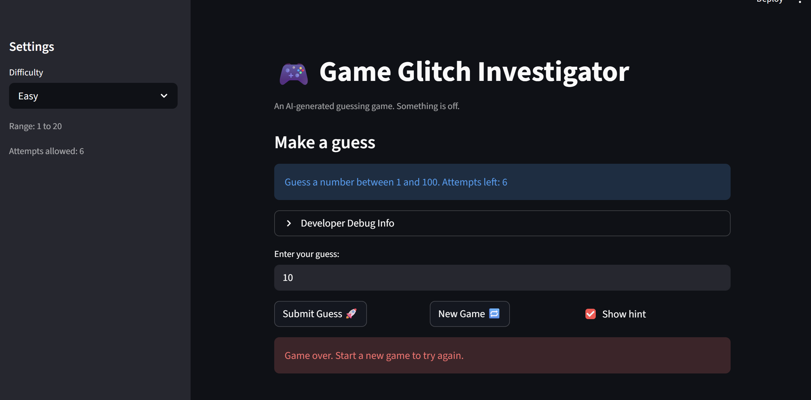

# 💭 Reflection: Game Glitch Investigator

Answer each question in 3 to 5 sentences. Be specific and honest about what actually happened while you worked. This is about your process, not trying to sound perfect.

## 1. What was broken when you started?

- What did the game look like the first time you ran it?

- List at least two concrete bugs you noticed at the start  
  (for example: "the hints were backwards").
### Bugs at the start:
- The hints was incorrect. For example, it tells us to go lower but it was, in fact, go higher.
- The game did not restart correctly once the New game button was clicked.
- The input did not automatically submit after pressing 'Enter' as suggested.
---

### Bugs Claude helped discover
- Hard and easy difficulty logic flawed. Easy 1-20 while Hard is 1-50 (should be more 1-200)
- Score not reset on new game (not st.session_state.score)
- Info message ignores difficulty -> it always says same for all difficulties.

## 2. How did you use AI as a teammate?

- Which AI tools did you use on this project (for example: ChatGPT, Gemini, Copilot)?
- Answer: I used Claude code to help me debug
- Give one example of an AI suggestion that was correct (including what the AI suggested and how you verified the result).
- Answer: One example of an AI suggestion being correct was that it suggested using st.form_submit_button to make Streamlit take 'Enter' key as a submission to a form.
- Give one example of an AI suggestion that was incorrect or misleading (including what the AI suggested and how you verified the result).
-Answer: One misleading suggestion was when it gave me solutions to the interconnected bug of attempts left and New game session restart. I had to prompt it back and forth a few times to get both bugs fixed.
---

## 3. Debugging and testing your fixes

- How did you decide whether a bug was really fixed?
- Answer: I let Claude generate test cases and verify it. Then I run the test using pytest and make sure everything passed. Then I manually ran the app using streamlit to see if it really works.
- Describe at least one test you ran (manual or using pytest)  
  and what it showed you about your code.
- One test I ran manually was first checking the winning guess and it should there was a bug! The assert and outcome type did not match.
- Did AI help you design or understand any tests? How?
- Answer: Yes, AI helped me a lot when designing tests, especially for tests related to difficulty range which I found hard to write test cases for.

---

## 4. What did you learn about Streamlit and state?

- How would you explain Streamlit "reruns" and session state to a friend who has never used Streamlit?
- Answer: I would explain Streamlit "reruns" and session state by comparing it React's state and useEffects or the JS's DOM or similar concept.

---

## 5. Looking ahead: your developer habits

- What is one habit or strategy from this project that you want to reuse in future labs or projects?
- Answer: One habit or strategy from this project would be to use multiple chat windows for each bug found and then later on generate test cases for each. It is a new working strategy which I think helps organize my workflow a lot.
- What is one thing you would do differently next time you work with AI on a coding task?
- Answer: I would refine my prompts more by giving more context and try to ask it to find inter-connectivity between bugs so that I would not have to prompt back and forth.
- In one or two sentences, describe how this project changed the way you think about AI generated code.
- Answer: I used to think that using AI in my workflow would make me really disorganized as I would have to use so many prompts to build and debug my code. However, now I know of the strategies and ways to use it as a coding partner in more organized and effective way.